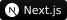
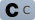

## Hello there and I am ALGO1832

<!--
**algorithm1832/algorithm1832** is a ✨ _special_ ✨ repository because its `README.md` (this file) appears on your GitHub profile.

Here are some ideas to get you started:

- 🔭 I’m currently working on ...
- 🌱 I’m currently learning ...
- 👯 I’m looking to collaborate on ...
- 🤔 I’m looking for help with ...
- 💬 Ask me about ...
- 📫 How to reach me: ...
- 😄 Pronouns: ...
- ⚡ Fun fact: ...
-->

```
Hello World! nya~
```

### Whoami

- A student proceeding for a master's degree at School of Software Technology, Zhejiang University
- A frontend developer seeking changes and trying out new things
- A learner in the field of AI

### Tech Stack



with



and more...